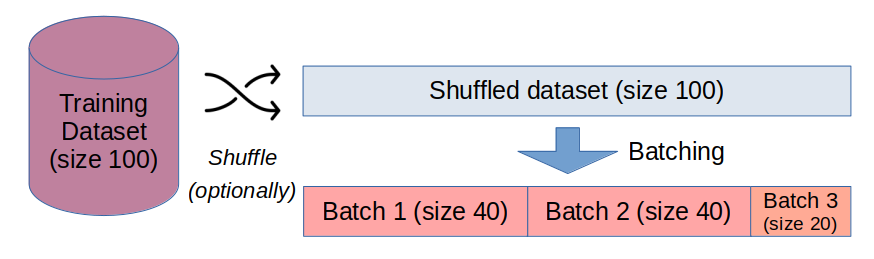
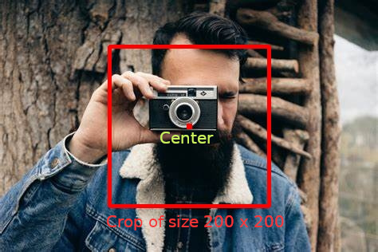
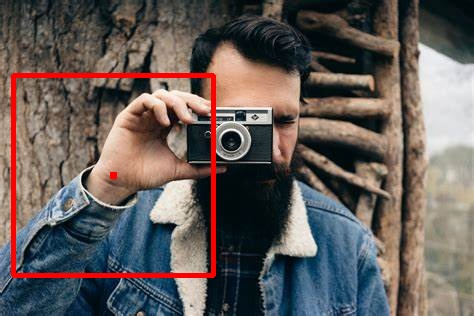
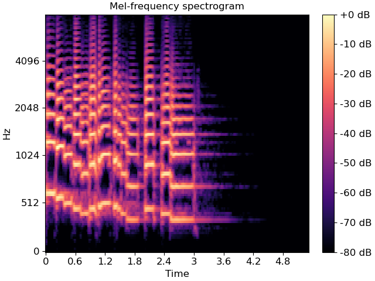

# Object-Oriented Programming Dataset Manager Project

The project contains the following elements:

- An implementation of a hierarchy of classes to manage datasets, mainly with Machine Learning as an end goal.
- A dataset wrapper, called `BatchLoader`, which handles the creation of batches of data for training a model.
- A set of preprocessing tools for image and audio data.

## Datasets

We implement a hierarchy of classes to manage datasets.

- [ ] The implementation will need to contain a base class, defining all the methods and attributes common to all the datasets.
- [ ] Datasets should have two variants: one including both data and labels, the other including only the data (which can be used, e.g., for testing when there are no labels available).
- [ ] All datasets should include a `root` attribute, which identifies the root location where the data is stored into the disk. Each data point (e.g., an image, an audio file) should be stored as a single file in the disk, with the name of the file uniquely identifying the data point.
- [ ] The datasets should return the number of datapoints in it if passed to the `len` built-in function.
- [ ] Datasets can be used for both regression and classification.

  * In the case of **regression**, the data should be stored on disk in the `root` folder (and not any subfolder), with the labels stored in a separate file outside of the `root` folder.
    The labels should be stored in a single file **outside of `root`**, with the file in a `.csv` format.
    Each line contains information about a data point: the first column contains the filename and the second column containing the corresponding label.
  * In the case of **classification**, there are two possible formats:

    1.  As in the case of regression, the data is stored in a single folder, with the labels stored in a separate file outside of the `root` folder, in a `.csv` file formatted as above.
    2.  The data is stored in a folder hierarchy, with each subfolder containing the data for a single class. For instance, if we have three categories, the data is stored in a folder hierarchy as follows:

        ```
        root
        ├── class_1
        │   ├── data_1
        │   ├── data_2
        │   └── data_3
        ├── class_2
        │   ├── data_4
        │   ├── data_5
        │   └── data_6
        └── class_3
            ├── data_7
            ├── data_8
            └── data_9
        ```

        Notice that, in this specific configuration, you don't need a file with labels, since the labels are already encoded in the folder hierarchy.

- [ ] The datasets should be able to load the data from the disk, both in a **lazy** and in an **eager** fashion. The eager implementation should **load all the data into memory at once**, while the lazy implementation should store only the data path and **load the data from the disk only when needed**.
      _Notice that this implementation does not necessarily need to be implemented with the usage of iterators or generators._

- [ ] In all cases, the data should be accessed using the subsetting operator (e.g., `dataset[i]`), which should return (using the data structure you prefer) the data at the specified index. In the case of a dataset with labels, we return both the data and the corresponding label. If the dataset has no labels, we return only the data.

- [ ] The datasets should have a method for **splitting** the data (and labels, if applicable) into training and test sets. The user is able to split the data by specifying the percentage of data to be used for training. This functionality returns two datasets as output (i.e. `train` and `test`).

- [ ] We create at least two datasets with these characteristics, one handling **images**, the other handling **audio files**.

### BatchLoader class

The BatchLoader will be constructed on top of a dataset, and will be responsible for creating batches of data for training a model using, e.g., Stochastic Gradient Descent.

- [ ] The BatchLoader should be able to create batches of data of a specified size.
- [ ] The user should specify whether they want the batches to be created in a **random** or in a **sequential** fashion:

  * In the case of **random** batches, the BatchLoader should create batches of data by randomly shuffling the order of the data points and then creating batches of the specified size.
  * In the case of **sequential** batches, no shuffling should be performed, and the batches should be created in the original order of the data points.

  Notice that, if `dataset_size // batch_size != 0` (i.e., the batch size is not a divisor of the dataset size), the last batch will be smaller than the specified batch size. You should let the user decide whether to use or to discard this last batch in case.

  

  The image above summarizes the process that the BatchLoader is tasked with carrying out, both for the random batches (shuffling is performed) and sequential batches (shuffling is not performed).

- [ ] Within the BatchLoader, the batches are to be created only using the **indices** of the data points, and the data composing the batch should be loaded from the disk only when needed using an iterator.

- [ ] If passed as argument to the `len` method, the BatchLoader should return the number of batches that can be created from the dataset with the specific batch size.

### Data preprocessing

In this step, we prepare at least **four** data preprocessing techniques as **callable classes** using OOP principles.

There is an ABC descirbing the generic behavior of the preprocessing tool.

Define the preprocessing technique as a class:

```python
class MyPreprocessingTechnique(PreprocessingTechniqueABC):
  def __init__(self, hyperparameter_1, hyperparameter_2):
    ...
```

The preprocessing technique should be used in this way:

```python
my_preproc_tech = MyPreprocessingTechnique(hyperparameter_1, hyperparameter_2)
new_data = my_preproc_tech(old_data)
```

- [ ] All the hyperparameters of these techniques---i.e., arguments that the user can specify for the transformations---**should be passed as arguments in the initialization**. The preprocessing technique, when called, **should have only data as arguments**, as in the snippet above.

- [ ] **Two classes** need to be for images.
- [ ] **Two classes** need to be for audio.
- [ ] In addition, you should create a datatype-agnostic preprocessing class that is able to sequentially perform multiple preprocessing steps.
      See the following subsections for more info.

#### Image preprocessing

1. Center crop: given an input image of any size `H` × `W`, return a cropped image of size `height` × `width`, whereas the center coordinates of the original image and the cropped image coincide. If the specified `height` **and** `width` are greater than the original image, the crop is not performed. In case, e.g., `H>height`, but `W<width`, then the crop is performed only on the height dimension. Below is an example of a 200 × 200 px center crop. After identifying the coordinates of the crop, you should return the image inside the red rectangle.



2. Random crop: given an input image of any size, return a cropped image of size `height` × `width`, whose coordinates of the top-left corner of the crop are sampled randomly. Be careful not to go out of the bounds of the original images. If the specified height and width are greater than the original image, the crop is not performed. Below is an example of a 200 × 200 px random crop. After identifying the coordinates of the crop, you should return the image inside the red rectangle.



3. Random patching: given an input image of any size, fill a window of the image with a pre-specified color. The top-left coordinate of this window is sampled randomly within the image. Let the user decide color, height and width of this window at initialization. Below is an example of random patching of size 30 × 39.


4. Padding: given an input image of any size `H` × `W`, if the image is smaller than a target height `height` or a target width `width`, fill the borders with a user pre-specified color until the image is of size `height` × `width`. In example below, the image was padded with blue bands up to a size of 400 × 500, whereas the starting size was 316 × 474.


5. Random flip: the image is flipped horizontally and vertically with a given probability `p`, specified by the user. Sample independently the event of horizontal and vertical flipping. In the example below, the image used before was flipped along its horizontal axis.


#### Audio preprocessing

1. Mel spectrogram: given an input audio track and a sampling rate, it should return a mel spectrogram of the given audio track. Mel spectrograms are a summary of the intensity of each frequency (on the mel scale, which is a human-perceptually meaningful sound frequency scale) of sound on each specific timestep of the audio track. Usually, they are used as input to Convolutional Neural Networks for audio data. You can see more info in [this video](https://www.youtube.com/watch?v=9GHCiiDLHQ4).



2. Random cropping: given an input audio track and a sampling rate, crop the audio sample on a random starting point for a given duration of `n` seconds. The output should be an audio track of duration `n` seconds and the same sampling rate. If the track is shorter than `n` seconds, than the original track is returned. Notice that the duration of the track can be easily recovered using librosa `get_duration` function.
3. Resampling: given an audio track and a sampling rate, it should return the resampled audio track with a different sampling rate. The operation is functionally similar to a resizing (scale up or down) of an image.
4. Pitch shifting: given an audio track and a sampling rate, shift the pitch by a user-specified factor.

#### Sequential application of preprocessing functions (pipeline)

As a last step, there is preprocessing class which implements a sequential pipeline of preprocessing steps.
This class takes as input (in the constructor) a variable number of preprocessing steps and applies them sequentially in the order they were passed.
It uses the **variadic arguments** option to implement the constructor.
This class has the same structure as any other preprocessing class (i.e. a callable class).
Application of preprocessing steps may not be **commutative**: for instance, applying resampling on a Mel spectrogram will raise an error.


